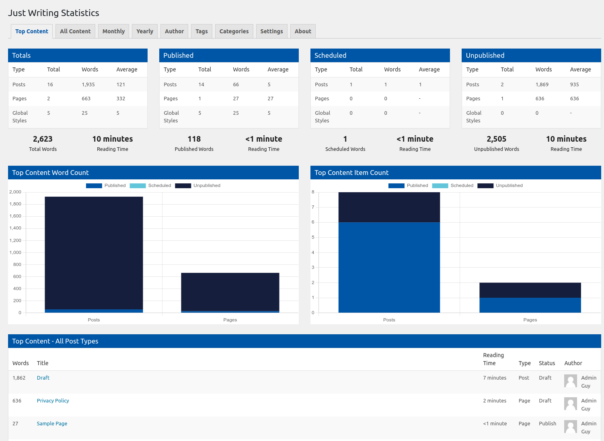
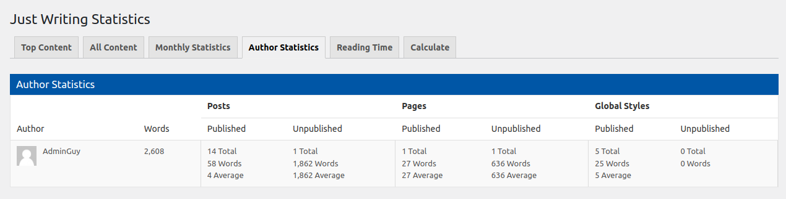
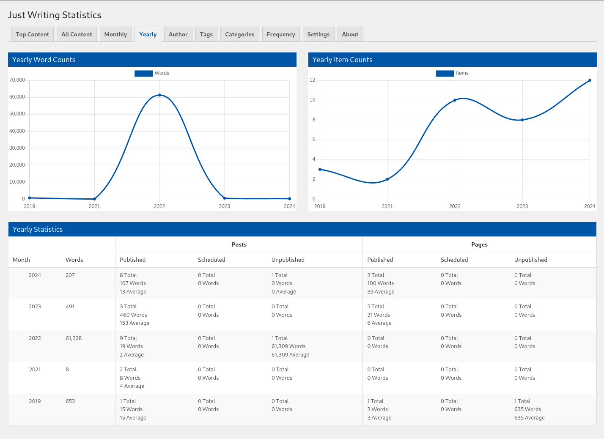

# Just Writing Statistics #
**Contributors:** [gregross](https://profiles.wordpress.org/gregross/), [redlettuce](https://profiles.wordpress.org/redlettuce/)  
**Tags:** word count, reading time, authors, words, writing  
**Requires at least:** 4.6  
**Tested up to:** 6.1.1  
**Stable tag:** 4.0  
**License:** GPLv2 or later  
**License URI:** http://www.gnu.org/licenses/gpl-2.0.html  

Calculate your writing statistics on your WordPress site instantly.

## Description ##

**Just Writing Statistics is a fork of WP Word Count**

Just Writing Statistics tells you exactly how many words you've written on your site with statistics by month and author.

Just Writing Statistics comes with built in reading time for each post and page of your site. Find out how many hours of content you've written or let readers know how long your articles are. You can include reading time at the top of each of your posts automatically or use a shortcode.

## Features ##

- Quickly see how many posts and pages you've created and how many total words they add up to.
- View and display estimated reading times for each piece of content on your site.
- Support for custom post types so you can monitor word counts from content created by your themes and plugins.
- View your writing output for each month broken down by post type.
- See all of your site author's word counts with breakdowns by post type.

## Installation ##

1. Upload `just-writing-statistics` to the `/wp-content/plugins/` directory
2. Activate the plugin through the 'Plugins' menu in WordPress
3. Just Writing Statistics can be accessed via the menu of the WordPress Admin.

## Frequently Asked Questions ##

### Why fork WP Word Count? ###

WP Word Count is by far the best plugin of its kind, however it is, as far as I can tell, abandoned at this point.

Even worse, the existing plugin has a known security vulnerability in it and so wordpress.org has closed the repository.

As such, a fork is required to fix the security issue and bring the plugin functionality back.

### How do the Just Writing Statistics Shortcodes work? ###

There are two shortcodes available:

* [just-writing-statistics] will display the number of words on any page or post.
* [just-writing-statistics-reading-time] will display the reading time of words on any page or post.

Every Just Writing Statistics shortcode can be extended with "before" and "after" attributes to add text or HTML before and after the result.

Example: [just-writing-statistics before="This post has" after=" total words."]

## Screenshots ##

### 1. Just Writing Statistics ###

### 2. Monthly Statistics ###

### 3. Author Statistics ###

### 4. Reading Time Settings ###

## Changelog ##

### 4.0 ###
* Release date: TBD
* Tested up to WordPress 6.1.1
* Fork from WP Word Count
* Security fixes
* Removal of Pro references
* Fix the menu icon
* Fix the settings link in the plugin list
* Fix various wp_debug warnings

### 3.2.3 ###
* Release date: 6 Oct 2021
* Tested up to WordPress 5.8.1
* We've been a bit quiet (sorry!), but busy behind the scenes! Get ready for some new features ready in Q4 2021!

### 3.2.2 ###
* Release date:  8 Sept 2020
* Tested up to WordPress 5.5.1

### 3.2.1 ###
* Release date:  2 June 2020
* Tested up to WordPress 5.4.1
* Updated plugin details

### 3.2.0 ###
* Release date: 2 Jan 2020
* New "Reading Time" statistic throughout the plugin.
* Added support for Gravatar/User Profile Images.

### 3.1.0 ###
* Release date: 8 Sept 2019
* New calculation options for sites with extremely large amounts of content.
* Menu changes.

### 3.0.2 ###
* Release date: 12 Apr 2019
* Interface changes.

### 3.0.1 ###
* Release date: 13 Sept 2018
* Interface changes and bug fixes.

### 3.0.0 ###
* Release date: 21 Feb 2017
* You can calculate your word counts any time you wish via the "Calculate" tab. This should help alleviate problems with plugin activation/updating on servers with limited resources.
* Automatically excluding common WordPress post types: Custom CSS, Navigation Menu Items.
* Support for Scheduled Posts.
* Support for Thrive Content Builder.
* Interface changes.
* General bug fixes.

## Upgrade Notice ##

None at this time.